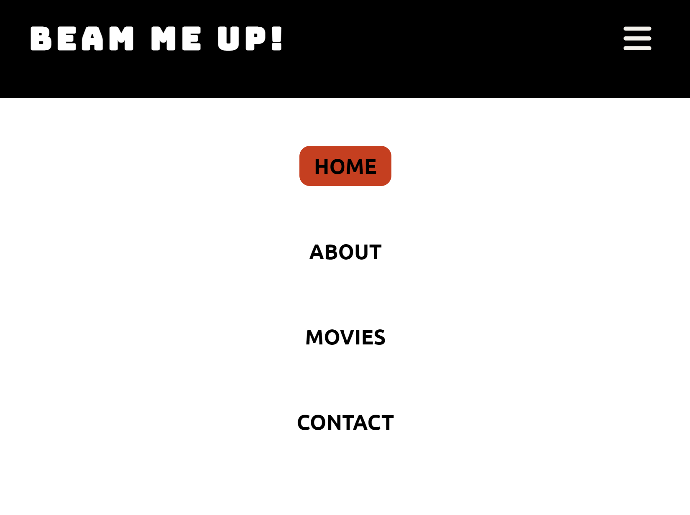
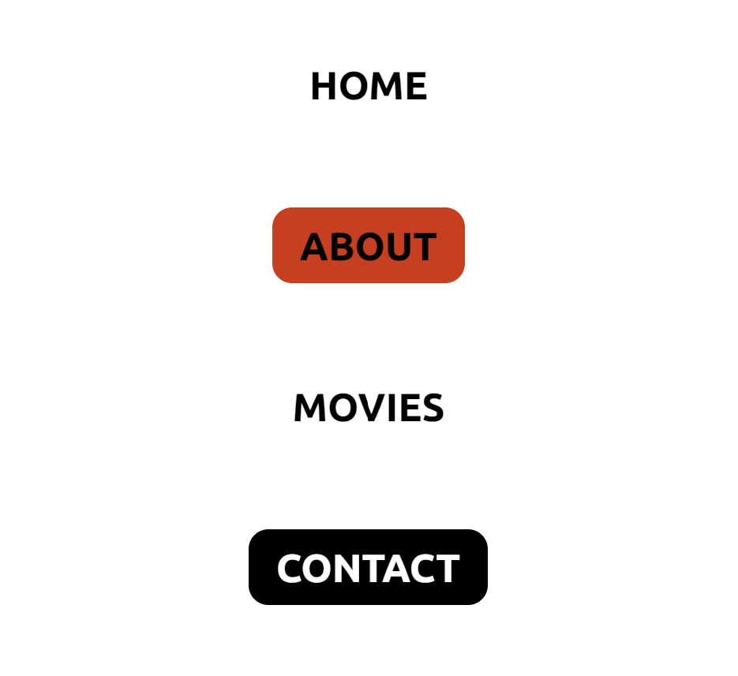
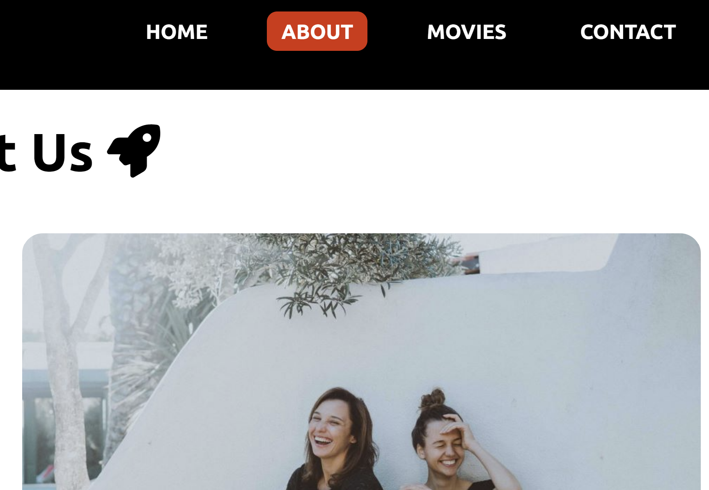
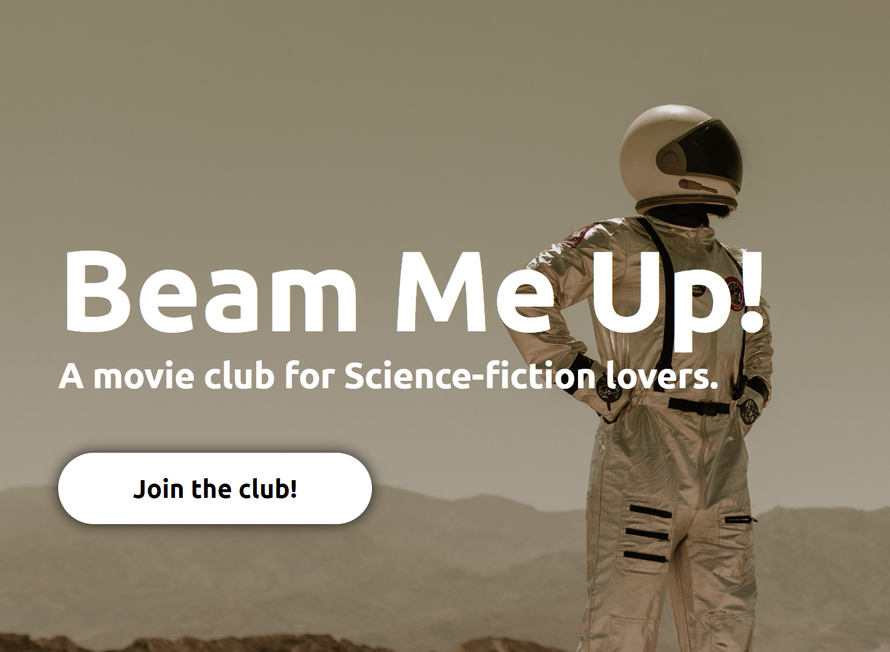
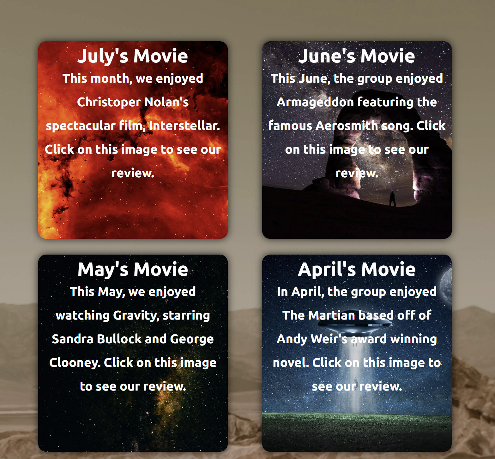
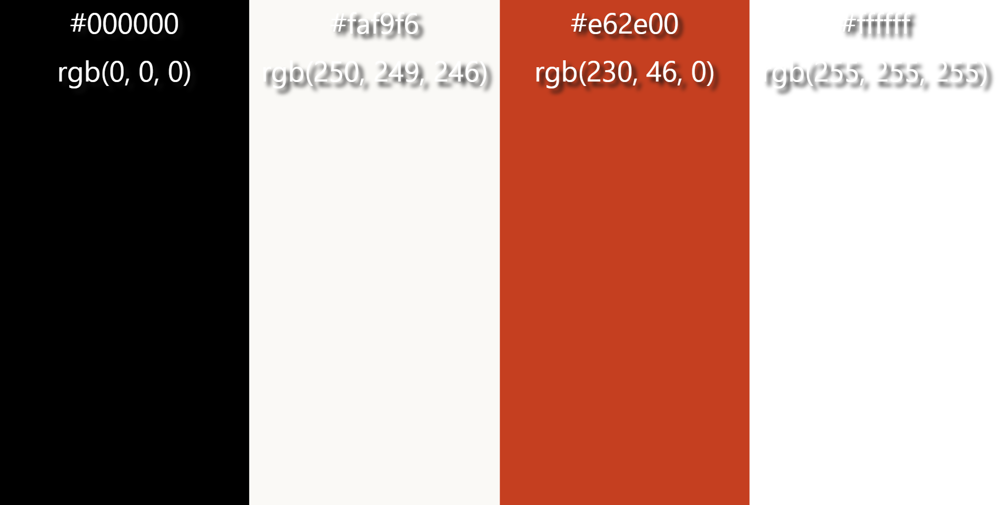
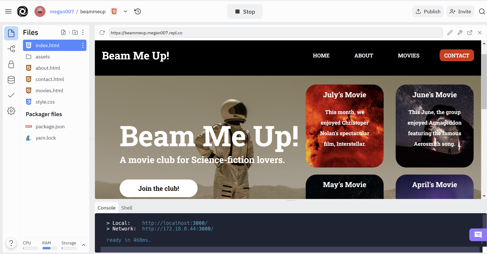

# Beam Me Up Website 

Beam Me Up is a website designed for visitors to find out about the 'Beam Me Up' movie club. As a movie club, they meet once a month to watch space-themed Sci-Fi movies locally in Brighton. They then discuss the movie after watching it and post short reviews giving their opinion on the movie. The reviews are not in-depth as it is a recreational club that enjoys watching this genre as a casual hobby. The club is free for members to join, as displayed in the about page. 

The Website is responsive, which can allow visitors to view the site on a multitude of devices. 

This website was created for educational purposes only and is a fictional concept.

View the live site here: https://megwana.github.io/beammeup/index.html

## 1. User Experience & Project Goals 

### First-time visitors

- For first-time visitors, I want them to understand what the website is about and to who it is targeted too. 
- In addition, I want users to find information about the movie club, such as meet times, and general information about the club so they can decide whether it's something they would want to be a part of. 

### Movie Club members 

- I want the existing members to be able to view our events and meet-up details with ease. 
- Furthermore, I would like existing members to view our conjoined reviews of films as a club and still be able to contact them formally through our club site, should they have any questions. 

### All visitors

- I want visitors to find the site easy to navigate. 
- I want the home page to invite them into sci-fi nostalgia but with still a modern feel. 
- I want visitors to be able to contact the site organizers with ease about any queries they may have. 
- I want visitors to see images on the about page of our club meeting for movie watching to highlight the social aspect of the club. 

## 2. Features 

### Current Features

-__Logo__

Beam Me Up logo has a link back to the home page for good user experience. 

-__Navigation Bar__

- On all three pages, there is a fully responsive navigation bar. The navigation bar includes the movie club's logo 'Beam Me Up', the Home Page, the About page, the movie review page, and the contact page. I have created the same on each page for ease of navigation. However, there is a difference on the contact page. When you hover over the link it highlights #ffffff instead of #e62e0 like the others. This is because contacting about joining the club and/or any queries are vital. Therefore, I wanted it to have a different identifier from the others to stick out from the other links on the navigation bar. (see below the desktop and mobile view images for reference. )

- The navigation bar will allow the user to easily navigate from each page (and across all devices) without having to regress to the previous page. 

Desktop view:

Smaller devices below:

As mentioned when you hover over the 'contact' icon, it highlights #ffffff on desktop view and #000000 on smaller devices. See below: 

Another feature of the navigation bar is that I have highlighted the icon to match the page you are on, so the visitor can easily see where they are on the website and navigate where they want to go next. Exemplified below in Desktop view:

-__The landing page background image__

The landing page includes a background image of an astronaut. The background image is meant to give an eye-catching feel of space themes.  

-__The landing page welcome introduction__

- There is a text overlay on the background image to the left of the landing page to highlight the name of the movie club and a brief description of what the club is; so an unknown visitor can immediately gauge the purpose of the site.

-__Contact Button__

- A button with the words 'join our club' features below the welcome introduction to encourage easy access to the contact page for visitors looking to join. 

-__Movie Review Cards__

- The four card segments on the landing page will allow the user to have quick access to the most recent movies viewed by the club. 
- Each segment provides a direct link to each month's more detailed review on the website's movie page.
- The four card segments have a space-themed background to match the space-themed science-fiction theme of the movie club.
- This section will be updated as these details change in order to keep members and potential new joiners up to date with the latest movies review each month.

[View Beam Me Up Movie Club on Github Pages] (https://megwana.github.io/beammeupm1/)

-__Meet up event times__

- The meet-up times enable visitors to view precise dates, times, and locations for when the movie club will be meeting. 
- This section will be updated as these details change in order to keep members and potential new joiners up to date.

-__The Footer__

The footer bar features links to all the relevant social media sites that Beam Me Up has accounted for. In addition, the links open into a new tab to let the site user have easy navigation and the ability to still browse the Beam Me Up website. 

### Future Features 

I intend to add an iframe with Google Maps to allow visitors the ease of locating the meet-up location.

## 3. Design

### Colour Schemes 

The reason I have chosen this color scheme for my website is:

I wanted there to be black and white as reoccurring colors to reflect the night sky. The more cream color was chosen to bring a link between the two and reflect the off-white nature of the moon. The fourth color I wanted to be rather bright because all my other colors are quite neutral. The Redish Orange is inspired by the color of the sun and is used to give a pop of color and highlight parts of the website. 

### Typography 

Google Fonts were used for the following fonts: 

- Bungee is used for the logo on the site. Bungee is a cursive font.
- Ubuntu is used for the rest of the site's fonts. Ubuntu is a serif font.

### Accessibility 

It is important to ensure that the website is user-friendly. I have fulfilled this by the following actions:

- I have used semantic HTML.
- Establishing adequate color contrast on the website overall.
- I have used alt and title attributes on images throughout the website.

## 4. Technologies Applied

### Languages Utilised 

To create this website, I have used two languages, HTML and CSS.

### Other Technologies

- Google Fonts: Imported for the fonts used.
https://fonts.google.com/
- Font Awesome: Used for all iconography.
https://fontawesome.com/
- Google Development Tools: Used to test/ troubleshoot any issues and find solutions.
 In addition, to review the website's responsiveness on different device dimensions.
- Github: Used to save and store all the files for Beam Me Up. 
https://github.com/enterprise?ef_id=3284471c0907111ab5f625fbdab0012a:G:s&OCID=AID2202670_SEM_3284471c0907111ab5f625fbdab0012a:G:s&msclkid=3284471c0907111ab5f625fbdab0012a
- Multi-device Website Generator: Link featured in the credits section. 
- Webformatter: To make the code easy to follow for marking. https://webformatter.com/

## 5. Testing

I have tested this site on Google Chrome, Mozilla Firefox and Microsoft Edge, and Safari.

### Validator Testing

To test my code, I used W3C Validator for both HTML and CSS.

* [Index Page HTML](assets/images/read.me.images/index.html-validator.png)
* [About Page HTML](assets/images/read.me.images/about.page-validator.png)
* [Movies Page HTML](assets/images/read.me.images/movies-validator.png)
* [Contact Page HTML](assets/images/read.me.images/contact-validator.png)
* [Style.css CSS](assets/images/read.me.images/css-validator.png)

### Lighthouse Testing 

Please see the final lighthouse review scores for each page: 

- Home Page (index.html)

Mobile Device:

Desktop Device: 

- About Page (about.html)

Mobile Device:

Desktop Device: 

- Movie Review Page (movies.html)

Mobile Device:

Desktop Device: 

- Contact Page (contact.html)

Mobile Device:

Desktop Device: 

### Bugs 

1. I was warned it was not good practice to have the left column as an h1 tag and should change this to an h2.

2. Removed '="text-input" after required on the contact form. The validator flagged this as a bad value. 'Required' as an attribute can be left on its own and does not require additional text. Therefore, I removed this. 

2. I was warned it was not good practice to have an anchor tag inside a button. Therefore, instead, I found an alternative on W3 Docs (https://www.w3docs.com/snippets/html/how-to-create-an-html-button-that-acts-like-a-link.html), which meant I could add the link using 'onclick' within the button tag.
. Despite the navbar being fixed, when on the contact page the form would overlap and cover the navbar when scrolling. This would prevent users from being able to easily access the menu at all times. They would have to scroll to the top on just the contact page which does not fit flush with the rest of the website, that can access the fixed navbar at all times when scrolling. While reading on W3Schools (https://www.w3schools.com/cssref/pr_pos_z-index.asp) I was reminded about the z-index. Therefore, to resolve the issue, I set the navbar to z-index 999 to guarantee it would always be stacked in front of other elements. 

4. When trying to make my website responsive, there would be a white block appearing on the right-hand side of the screen. I fixed this by using 'overflow-x: hidden' in the media screen max-width 768px after researching this on https://www.w3schools.com/. 

### Unfixed Bugs 

The best practice score is affected on the website by the images and youtube embedded iframes. 

1. I have tried to resolve the website images by re-sizing, compressing, and reducing them to the appropriate size. However, it now says the images have been reduced to a size and should be their original size. 

2. For the embedded iframes it is not registering the 'SameSite: None' & 'secure' Attribute or the 'no-cookies' added to the youtube link which has been the advice for troubleshooting when I have researched this issue. However, I am still in the process of resolving this to boost my best practice score and overall performance. 

## 6. Deployment

GitHub pages were used to deploy the live website of Beam Me Up. The measures to deploy the website are as follows:

Step 1: Logged on to GitHub Pages.

Step 2: Navigated to the settings tab, which can be found in the GitHub repository for Beam Me Up.

Step 3: On the left-hand column, I went to Pages and selected the master branch 'main'.

Step 4: Once the mast branch was selected, I clicked 'save' and the page automatically refreshed with a live link at the top of the page, registering the website's successful deployment.

The live link can be found here - https://megwana.github.io/beammeup/index.html

## 7. Credits

### Code Used

- 'Easy Tutorials' Youtube Channel: This inspired the left and right column for my home page. However, I changed elements to suit my preferences and the website.
https://www.youtube.com/watch?v=Oa9LTDR9ugU

- 'Coding Nepal' Youtube Channel: This inspired the function of the navigation bar when used on devices with a max-width of 992px. However, I changed elements to suit my preferences and the website.
https://www.youtube.com/watch?v=oLgtucwjVII

- Dom from 'dcode' Youtube Channel: His code for creating an Accordion was how I created my drop-down box on the movies review page. I changed parts to suit my website but I directly used the triangle image he has for the drop-down symbol and the code that allows it to rotate.
https://codepen.io/dcode-software/pen/oNjXqzg

- Love Running project - similar code used for the event/ times meetup. 

### Disclosures

- Please note, instead of using e.g. Balsamiq, I used replit first to play around with the framework with a more hands on feel. Therefore, I may not have as many commits in the initial stage because I built a lot of the basics on replit first and transferred this over. In future, I will build and commit from github as good practice. 

### Acknowledgments & Thank yous

Thank you to my mentor Jubril Akolade for your support and feedback on my project which helped me develop it into its finished state.

Including, the standard breakpoints for a responsive website via https://www.w3schools.com/

Thank you Ashkat Garg for the recommendation of the following technologies:

- TinyPNG - https://tinypng.com/
- Multi Device Website Generator - http://techsini.com/multi-mockup/index.php
- Flexbox Froggy - https://flexboxfroggy.com/
- Webformatter - https://webformatter.com/

A special thank you to the helpful feedback from Kera Cudmore and Mateusz for my Peer Review.

### Media

All images used on the website were from the following websites where you can use the images for free: 

- Pexels https://www.pexels.com/
- Pixabay https://pixabay.com/

All the trailers on the movie review page are via: 

- https://www.youtube.com/

For the brief synopsis for each movie before the drop-down box, I used the descriptions from 'imbd' as they gave accurate and concise descriptions that were very fitting for each movie.

- https://www.imdb.com/